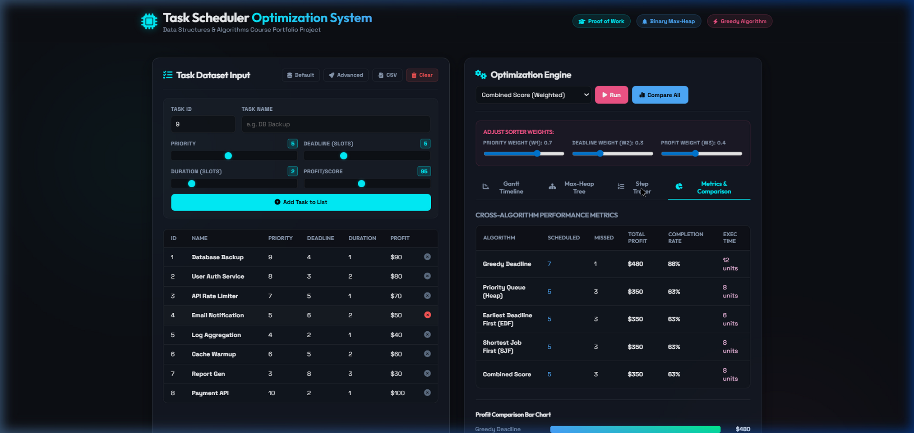
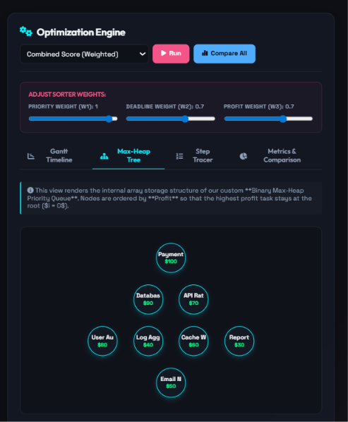
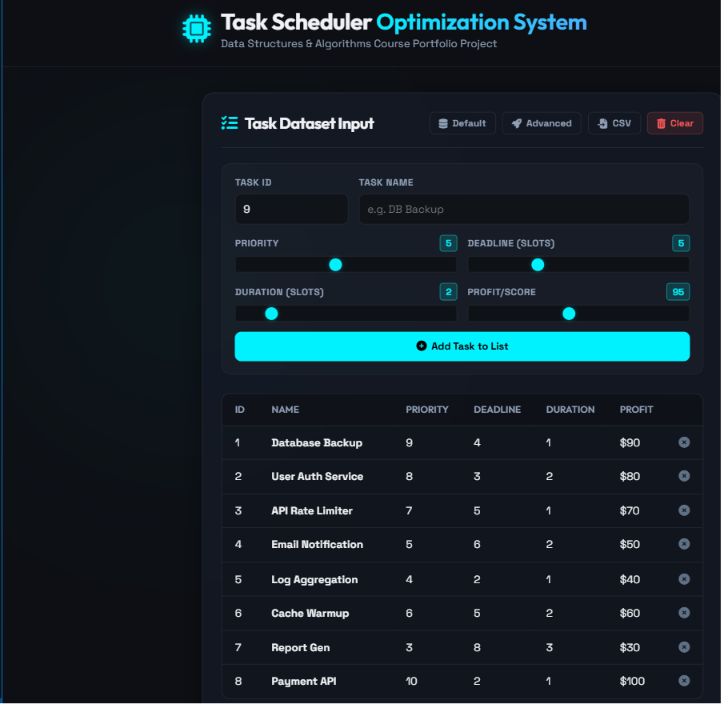
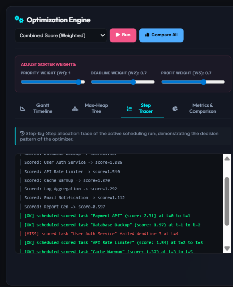

# 🚀 Task Scheduler Optimization System


A comprehensive **Data Structures & Algorithms (DSA)** project that simulates real-world task scheduling and resource allocation systems used in **Operating Systems, Cloud Computing Platforms, Distributed Systems, and Project Management Applications**.

The system optimizes task execution under deadline constraints using multiple scheduling strategies including **Greedy Scheduling, Priority Queue Scheduling, Earliest Deadline First (EDF), and Shortest Job First (SJF)**. It features a custom-built **Binary Max-Heap Priority Queue**, detailed performance analytics, automated reports, and an interactive web dashboard for visualization.

---

# 📌 Project Overview

Modern computing systems continuously process thousands of tasks with varying priorities, execution times, deadlines, and business values.

Without proper scheduling:

* Critical tasks may miss deadlines
* High-value jobs may be delayed
* System throughput decreases
* Resource utilization becomes inefficient

This project addresses these challenges by implementing optimized scheduling algorithms that maximize task completion value while minimizing missed deadlines.

---

# 🎯 Problem Statement

Given a collection of tasks where each task contains:

* Task Name
* Priority Level
* Deadline
* Execution Time
* Profit / Importance Score

Determine the most efficient execution order that:

✅ Maximizes total profit

✅ Minimizes missed deadlines

✅ Improves overall resource utilization

✅ Produces an optimized execution timeline

---

# 🌍 Real-World Applications

## Operating Systems

CPU Scheduling:

* Priority Scheduling
* Earliest Deadline First
* Shortest Job First

## Cloud Computing

Used for:

* Container Scheduling
* Job Dispatching
* Resource Allocation
* Server Workload Management

## Project Management Systems

Applications like:

* Jira
* Trello
* Asana
* Monday.com

prioritize tasks using similar scheduling concepts.

## Enterprise Systems

* Workflow Automation
* Batch Processing
* Background Job Execution
* Data Pipeline Scheduling

---

# 🏗️ System Architecture

```text
                    +--------------------+
                    |    Task Input      |
                    +----------+---------+
                               |
                               v
                    +--------------------+
                    | Validation Engine  |
                    +----------+---------+
                               |
                               v
                    +--------------------+
                    | Preprocessing      |
                    | Sorting Module     |
                    +----------+---------+
                               |
                               v
                    +--------------------+
                    | Scheduling Engine  |
                    +----------+---------+
                               |
         +---------------------+---------------------+
         |                     |                     |
         v                     v                     v
  Greedy Scheduler     EDF Scheduler       SJF Scheduler
         |                     |                     |
         +----------+----------+----------+----------+
                               |
                               v
                    +--------------------+
                    | Priority Queue     |
                    | Binary Max Heap    |
                    +----------+---------+
                               |
                               v
                    +--------------------+
                    | Timeline Generator |
                    +----------+---------+
                               |
                               v
                    +--------------------+
                    | Report Generator   |
                    +----------+---------+
                               |
                +--------------+--------------+
                |                             |
                v                             v
       CLI Dashboard               Web Dashboard
```

---

# ⚙️ Features

## Task Management

* Add tasks dynamically
* Validate task parameters
* Deadline-aware scheduling
* Priority-based execution

## Multiple Scheduling Algorithms

### Greedy Deadline Scheduler

Solves the classic Job Sequencing with Deadlines problem.

### Priority Queue Scheduler

Uses a custom Binary Max-Heap for task dispatching.

### Earliest Deadline First (EDF)

Schedules tasks with the nearest deadlines first.

### Shortest Job First (SJF)

Minimizes average waiting and turnaround time.

### Weighted Scoring Scheduler

Balances:

* Priority
* Profit
* Deadline

using configurable weights.

---

# 📚 Core DSA Concepts Demonstrated

| Concept                     | Application                  |
| --------------------------- | ---------------------------- |
| Arrays                      | Heap Storage                 |
| Sorting                     | Deadline & Priority Ordering |
| Binary Trees                | Heap Representation          |
| Priority Queue              | Task Dispatching             |
| Greedy Algorithms           | Profit Optimization          |
| Queues                      | Sequential Execution         |
| Object-Oriented Programming | Task Modeling                |
| Complexity Analysis         | Performance Evaluation       |

---

# 🧮 Custom Binary Max-Heap

The project implements a Binary Max-Heap completely from scratch without using Python's built-in heapq module.

Supported Operations:

### Insert

```text
Time Complexity: O(log n)
```

### Extract Maximum

```text
Time Complexity: O(log n)
```

### Peek Maximum

```text
Time Complexity: O(1)
```

### Build Heap

Uses Floyd’s Heap Construction Algorithm.

```text
Time Complexity: O(n)
```

---

# 📊 Algorithm Complexity Analysis

| Algorithm                | Average Case | Worst Case | Space Complexity |
| ------------------------ | ------------ | ---------- | ---------------- |
| Heap Insert              | O(log n)     | O(log n)   | O(1)             |
| Heap Extract             | O(log n)     | O(log n)   | O(1)             |
| Build Heap               | O(n)         | O(n)       | O(1)             |
| Greedy Scheduler         | O(n²)        | O(n²)      | O(d)             |
| Priority Queue Scheduler | O(n log n)   | O(n log n) | O(n)             |
| EDF Scheduler            | O(n log n)   | O(n log n) | O(n)             |
| SJF Scheduler            | O(n log n)   | O(n log n) | O(n)             |

---

# 📂 Project Structure

```text
Task-Scheduler-Optimization-System/
│
├── data/
│   └── tasks.csv
│
├── docs/
│   ├── architecture.md
│   └── design_notes.md
│
├── images/
│   ├── dashboard_preview.png
│   ├── gantt_chart.png
│   ├── heap_visualization.png
│   └── report_output.png
│
├── outputs/
│   ├── schedule_report.txt
│   └── performance_report.csv
│
├── src/
│   ├── task.py
│   ├── validator.py
│   ├── sorter.py
│   ├── priority_queue.py
│   ├── scheduler.py
│   ├── report.py
│   └── simulation.py
│
├── tests/
│   └── test_scheduler.py
│
├── index.html
├── styles.css
├── app.js
├── main.py
├── requirements.txt
├── README.md
└── .gitignore
```

---

# 🚀 Installation

## Clone Repository

```bash
git clone https://github.com/your-username/Task-Scheduler-Optimization-System.git

cd Task-Scheduler-Optimization-System
```

## Create Virtual Environment

### Windows

```bash
python -m venv venv

venv\Scripts\activate
```

### Linux / macOS

```bash
python3 -m venv venv

source venv/bin/activate
```

## Install Dependencies

```bash
pip install -r requirements.txt
```

---

# ▶️ Running the Project

## Launch Interactive CLI

```bash
python main.py
```

## Run Automated Simulation

```bash
python main.py --simulate
```

## Compare All Scheduling Algorithms

```bash
python main.py --algorithm all
```

## Generate Reports

```bash
python main.py --algorithm all --save
```

## Launch Web Dashboard

```bash
python main.py --web
```

---

# 📈 Sample Workflow

```text
Task Input
     ↓
Validation
     ↓
Sorting
     ↓
Heap Construction
     ↓
Scheduling Algorithm
     ↓
Timeline Generation
     ↓
Performance Analysis
     ↓
Report Export
```

---

# 📊 Sample Output

```text
====================================================

SCHEDULE RESULT - Greedy Deadline Scheduler

====================================================

Scheduled Tasks

1. Payment API
2. Database Backup
3. User Authentication

Missed Tasks

1. Logging Service
2. Notification Service

Total Profit: 270

Deadline Success Rate: 85%

====================================================
```

---

# 📸 Screenshots

## Dashboard Overview



## Heap Visualization



## Scheduling Timeline



## Performance Report



---

# 🧪 Testing

Run all test cases:

```bash
python -m pytest tests/
```

The test suite covers:

* Heap Operations
* Scheduler Logic
* Edge Cases
* Validation Rules
* Deadline Constraints
* Report Generation

---

# 🎯 Learning Outcomes

This project demonstrates practical understanding of:

* Binary Heap Design
* Priority Queue Implementation
* Scheduling Algorithms
* Greedy Optimization
* Resource Allocation Strategies
* Algorithm Complexity Analysis
* Data Visualization
* Automated Testing
* Software Engineering Practices

---

# 🚀 Future Enhancements

Planned improvements:

* Multi-Core CPU Scheduling
* Round Robin Scheduling
* Dynamic Priority Aging
* Real-Time Scheduling Simulation
* REST API Integration
* Database Connectivity
* Docker Deployment
* Machine Learning Based Task Prediction

---

# 💼 Portfolio Value

This project showcases skills relevant to:

* Software Development Engineer (SDE)
* Backend Developer
* System Design Engineer
* Platform Engineer
* Cloud Engineer
* Algorithm Developer
* Technical Interview Preparation

Key Highlights:

✔ Custom Binary Max-Heap Implementation

✔ Multiple Scheduling Algorithms

✔ Deadline-Constrained Optimization

✔ Performance Benchmarking

✔ Interactive Dashboard

✔ Automated Testing Framework

✔ Professional Documentation

---

# 🧠 Interview Questions

### Why did you implement a Binary Max-Heap from scratch?

To demonstrate understanding of heap internals, tree-array mapping, heapify operations, and priority queue implementation without relying on built-in libraries.

### Why use Greedy Scheduling?

The Job Sequencing with Deadlines problem possesses optimal substructure and greedy-choice properties, making greedy scheduling an efficient solution for profit maximization.

### What are the real-world applications?

* CPU Scheduling
* Cloud Resource Allocation
* Workflow Automation
* Task Management Systems
* Batch Processing Systems

---

# 👨‍💻 Author

**Sarthak Dhumal**

Data Structures & Algorithms Enthusiast

Focused on:

* Software Development
* Backend Engineering
* System Design
* Competitive Programming
* Optimization Algorithms

---

## ⭐ If you found this project useful, consider giving it a star on GitHub!
